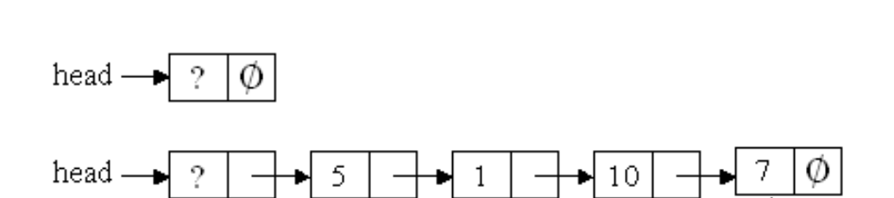
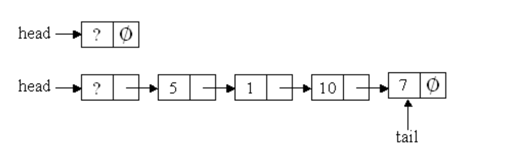

### 1. 链表（80分）

#### 题目描述

实现链表，在List.h文件中，接口定义如下：

```c++
//注意：
// 我们保证传进来的任何指向Node的指针都是合法的，我们也只传这样的指针或者nullptr，但是不保证下标是合法的范围。


#ifndef LIST_H
#define LIST_H

//节点类型
typedef struct Node {
	int val;
	Node* next;
} Node;

//链表定义
typedef struct Node* List;

//初始化
//return: head pointer
List init();

// 插入节点，在head之后第i个位置插入值为val的节点，成功返回true，失败返回false。
bool insert(List& head, int i, int val);

//删除节点，删除head之后第i个位置的元素,成功返回true，失败返回false
//只有执行了delete操作的情况才能返回true。否则一律返回false。
bool erase(List& head, int i);

//打印所有节点的数据，每个节点以空格分隔，最后一个元素接换行
void show(List& head);

//删除所有元素，也需要删除head pointer。注意内存泄漏。在clear调用之后，需要将head赋值为空指针。
void clear(List& head);

#endif // !LIST_H

```

调用示例：

```c++
List head = init();
cout << insert(head, 0, 8) << endl;
cout << insert(head, 0, 9) << endl;
cout << insert(head, 1, 10) << endl;
cout << insert(head, 10, 1) << endl;
cout << insert(head, 3, 11) << endl;
show(head);
cout << erase(head, 0) << endl;
cout << erase(head, 10) << endl;
show(head);
clear(head);
cout << insert(head, 0, 8) << endl;
cout << erase(head, 0) << endl;
```

输出结果：

```c++
1
1
1
0
1
9 10 8 11
1
0
10 8 11
0
0
```

--------

 一个简单的示意图如下图所示，因此你需要在init函数中生成head pointer。请仔细观察下图，并理解头指针和头结点的区别。链表的下标与数组一致，都是从0开始（也就是说**下图的val为5的结点的下标为0**）。**clear函数需要删除所有的元素包括head node**。请你一定保证代码的鲁棒性，**特别对于空指针的情况需要特别的注意**，我们使用的都是随机测试，如果用random函数你是无法通过任何测试的。另外，请不要使用STL，我们会在编译过程中禁止你使用STL，如果你使用的话将会产生编译错误。上述函数除了`init()`只会调用一次，其他所有的函数都可能会多次调用，请保证程序的鲁棒性。遇到error很多或者得分很低的情况，请不用慌张，仔细阅读程序接口注释的相关内容。



#### 提交要求

- 提交一个源码文件List.cpp，实现给定的接口，直接打包成zip格式的压缩包。**不要添加其他任何目录,压缩包中只包含这一个文件!**

- 文件的编码格式只支持utf-8。

- 请严格按照给定的接口进行编码,否则无法调用测试用例。

- **提交的源码文件中不需要包含main函数,否则无法通过编译。**

  

### 2.队列（20分）

#### 题目描述

基于第一问中实现的链表，实现一个FIFO(Fist In First Out)的队列。在Queue.h文件中，接口定义如下：

```c++

#ifndef QUEUE_H
#define QUEUE_H
#include "List.h"

//FIFO
typedef struct Queue {
	int size;
	List head;
	List tail;
};

//初始化
void init(Queue& q);

//入队，在队列末尾插入值为val的节点
void push(Queue& q, int val);

//出队列
bool pop(Queue& q);

//判断是否为空
bool empty(Queue& q);

//打印队列
void show(Queue& q);

//返回队首元素值，如果队列为空，返回-1
int front(Queue& q);

//返回队尾元素值，如果队列为空，返回-1
int back(Queue& q);

// 相当于一个析构函数。清空队列，也需要清空head。
void clear(Queue&q);
#endif // !QUEUE_H

```

调用示例：

```c++
Queue q;
init(q);
push(q, 1);
push(q, 2);
push(q, 3);
cout << front(q) << endl;
cout << back(q) << endl;
pop(q);
cout << front(q) << endl;
show(q);
```

输出结果：

```C++
1
3
2
2 3
```


> 一个简单的示意图如下图所示，因此你需要在init函数中生成head node和tail node。因为队列是先进先出，所以每次加入只需要加入队尾（tail node需要相应的改变），每次pop会将队头的结点移除。


#### 提交要求

- 提交两个个源码文件，包括List.cpp (直接沿用第一题)和Queue.cpp (实现Queue.h中声明的接口) ,直接打包成zip格式的压缩包。**不要添加其他任何目录，压缩包中只包含这两个个文件!**
- 文件的编码格式只支持utf-8。
- 请严格按照给定的接口进行编码,否则无法调用测试用例。
- **提交的源码文件中不需要包含main函数,否则无法通过编译。**
